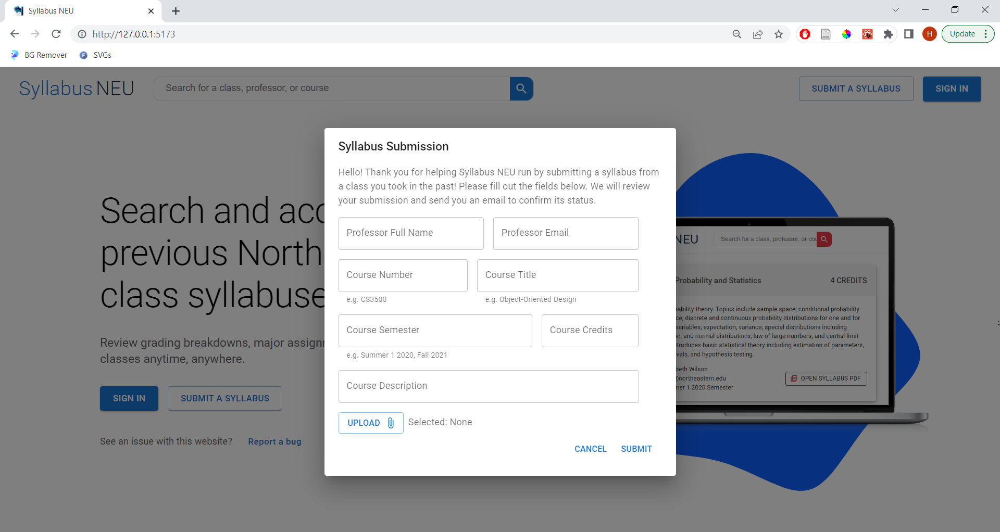
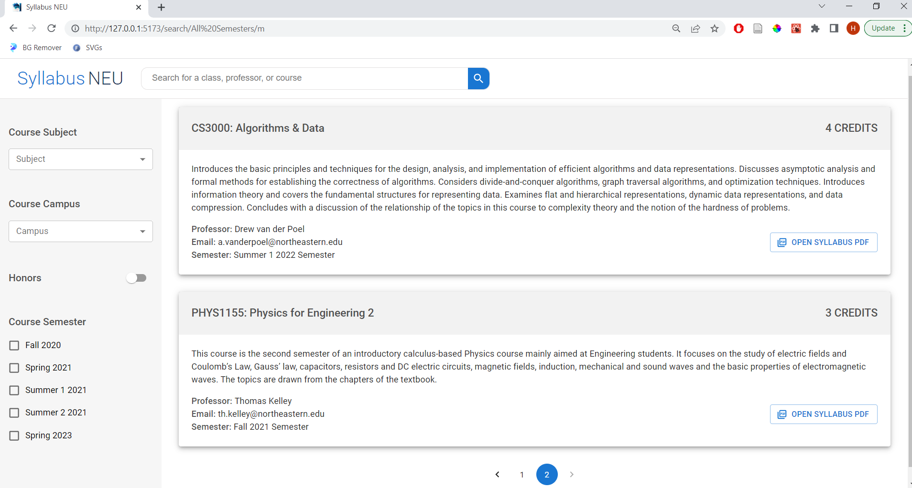

# General
Syllabus NEU is an independent effort to provide 15,000+ Northeastern University (NEU) undergraduates access to a search catalog of 4,000+ previous NEU class syllabi to assist with course registration. Within a single course, the grading criteria and requirements set out by professors can vary widely, highlighting the need for students to know a class's syllabus before registering for a particular section of the course. Students can help Syllabus NEU by submitting a syllabus and its corresponding course information on Syllabus NEU's homepage for review by an administrator.

# Demonstrations
The following images are examples of fully functional, responsive components designed with React, TypeScript, MUI, and Adobe Illustrator.

## Landing Page

## Syllabus Submission Form

## Search Results


# Development
## Overview
This project is a monorepo containing the client-facing presentation code in `/src/` and a back-end RESTful API concerned with exposing a HTTP interface to the front-end in `/backend/main.ts`. The front-end is designed using React and TypeScript to promote an error-free, maintainable codebase with strongly-typed variables. For standardizing component styling, <a href='https://mui.com/'>Material UI</a> was utilized with <a href='https://github.com/styled-components/styled-components'>styled-components</a> as the CSS-in-JS solution. 

The back-end was designed using Express and TypeScript to handle all AWS cloud storage uploads and database queries. To run the back-end with Node, a TypeScript to CommonJS transpilation npm script was created as described further below. For storing syllabus PDFs, AWS S3 buckets are employed. The PDF's corresponding course information including fields such as course title, professor, and semester are stored in a DynamoDB table. 
## Workflows
As described in the introduction, students can submit a syllabus to add to Syllabus NEU's database. The process of syllabus submission is as follows:
<ol>
    <li>The student fills out the fields in the syllabus submission form and attaches a PDF of their syllabus (skip to step 3). </li>
    <li>Upon submission, the data is sent to a DynamoDB table storing pending submissions where an administrator can review and modify the submitted information and accept/decline (not yet implemented).</li>
    <li>Once accepted (currently automatically accepted), the syllabus PDF is uploaded to S3 with a randomly generated key identifier. The PDF's corresponding course information is sent to a DynamoDB table with an additional key-value pair holding the randomly generated key identifier used for storing the PDF in S3.</li>
</ol>
The process that occurs when a visitor searches for a class's syllabus in the search engine is as follows:
<ol>
    <li>React Router DOM navigates the visitor to an endpoint containing information about the semester they selected (defaults to all semesters) and the search term they inputted.</li>
    <li>The search results page retrieves all data in Syllabus NEU's DynamoDB table. For each JSON object, a custom, boolean utility function is used to determine if the object matches the search term. If it does, then the S3 key identifier stored in the object is sent to the AWS S3 Request Presigner, which generates a temporary URL to provide visitors access to the syllabus PDF stored in S3. If not, then the object is filtered out.</li>
    <li>The matching JSON objects with their temporary AWS S3 URLs are mapped onto the search results page.</li>
</ol>


## Running The Project
This project requires NodeJS (<a href="https://nodejs.org/en/download/">latest</a> version recommended). Before starting, make sure that the current working directory is the root of this project and not one directory above it (i.e. `arbitrary/path/.../Syllabus-NEU`). Run 
```
npm install
```
in both the root directory and `/backend` to install the dependencies. To start the React front-end application, run 
```
npm run dev
```
in a terminal from the root directory. Open up a second terminal and also run
```
npm run transpile-api
npm run start-api
```
from the root directory to activate the Express back-end server. The entire back-end is written in TypeScript, which is not interpretable by NodeJS. To resolve this issue, `npm run transpile-api` transpiles the TypeScript code into CommonJS and outputs the transpiled code to `/backend/api/transpiled-api/`.

## Linting
This project uses <a href="https://www.npmjs.com/package/eslint-config-airbnb-typescript">eslint-config-airbnb-typescript</a> and <a href="https://prettier.io/">prettier</a> for enforcing code style and formatting. For integration with git, <a href="https://typicode.github.io/husky/#/">husky</a> is used for automating code formatting before every commit and works in tandem with <a href="https://github.com/conventional-changelog/commitlint">commitlint</a> to lint commit messages according to the <a href="https://www.conventionalcommits.org/en/v1.0.0/">conventional commit format</a>. The complete list of configurable commit message rules can be found <a href="https://github.com/conventional-changelog/commitlint/blob/master/docs/reference-rules.md">here</a>. To get started, run the following in the root directory
```
npm install
npm run prepare
```
and download the eslint and prettier extensions for Visual Studio Code. 
# Miscellaneous
```
@startuml
package "Client Browser" {
  [React/TypeScript/MUI Front-End (/src)] as Frontend
} 

cloud AWS {
  [Node.js Express RESTful API (/backend/api/transpiled-api/main.js)] as Backend
  [DynamoDB NoSQL Database] as DB
  [AWS S3 Bucket Storage] as S3
  [S3 Request Presigner] as S3URL
} 

package "Express Server" {
  [Express/TypeScript RESTful API (/backend/main.ts)] as UncompiledBackend
}


Frontend <.d.> Backend : HTTPS (external)
Backend <.l.> DB : HTTPS (internal)
S3 <.u.> Backend : HTTPS (internal)
S3URL <.u.> Backend: HTTPS (internal)

UncompiledBackend .d.> Backend : transpiled into
@enduml
```
